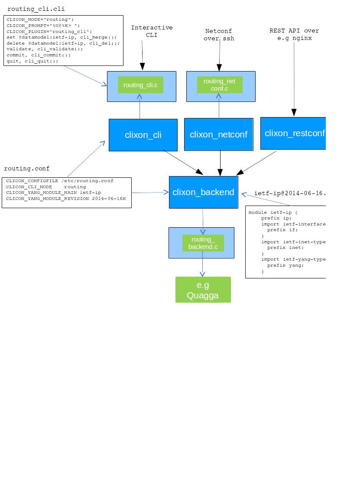

# Clixon

Clixon is an automatic configuration manager where you generate
interactive CLI, NETCONF, RESTCONF and embedded databases with
transaction support from a YANG specification.

Table of contents
=================
  * [Documentation](#documentation)
  * [Installation](#installation)
  * [Dependencies](#dependencies)
  * [Licenses](#licenses)
  * [Background](#background)
  * [Clixon SDK](#SDK)

Documentation
=============
- [Frequently asked questions](doc/FAQ.md)
- [XML datastore](datastore/README.md)
- [Netconf support](apps/netconf/README.md)
- [Restconf support](apps/restconf/README.md)
- [Reference manual](http://www.clicon.org/doxygen/index.html) (Note the link may not be up-to-date. It is better to build your own: cd doc; make doc)
- [Routing example](example/README.md)
- [Clicon and Clixon project page](http://www.clicon.org)
- [Tests](test/README.md)

Installation
============
A typical installation is as follows:
```
     configure	       	       # Configure clixon to platform
     make                      # Compile
     sudo make install         # Install libs, binaries, and config-files
     sudo make install-include # Install include files (for compiling)
```

One [example application](example/README.md) is provided, a IETF IP YANG datamodel with
generated CLI and configuration interface.

Dependencies
============
Clixon is dependend on the following software packages, which need to exist on the target machine.
- [CLIgen](http://www.cligen.se) is required for building Clixon. If you need 
to build and install CLIgen: 
```
    git clone https://github.com/olofhagsand/cligen.git
    cd cligen; configure; make; make install
```
- Yacc/bison
- Lex/Flex
- Fcgi (if restconf is enabled)
- Qdbm key-value store (if keyvalue datastore is enabled)

There is no yum/apt/ostree package for Clixon (please help?)

Licenses
========
Clixon is dual license. Either Apache License, Version 2.0 or GNU
General Public License Version 2. You choose.

See [LICENSE.md](LICENSE.md) for license, [CHANGELOG](CHANGELOG.md) for recent changes.

Background
==========
We implemented Clixon since we needed a generic configuration tool in
several projects, including
[KTH](http://www.csc.kth.se/~olofh/10G_OSR). Most of these projects
were for embedded network and measuring-probe devices. We started with
something called Clicon which was based on a key-value specification
and data-store. But as time passed new standards evaolved and we
started adapting it to XML, Yang and netconf. Finally we made Clixon
where the legacy key specification has been replaced completely by
YANG and using XML as configuration data. This means that legacy
Clicon applications do not run on Clixon.

SDK
===



The figure shows the SDK runtime of Clixon.

YANG and XML is at the heart of Clixon.  Yang modules are used as a
specification for handling XML configuration data. The spec is also
used to generate an interactive CLI client as well as provide
[Netconf](apps/netconf/README.md) and
[Restconf](apps/restconf/README.md) clients.

The [YANG RFC 6020](https://www.rfc-editor.org/rfc/rfc6020.txt) is implemented with the following exceptions:
- object-references
- if-feature
- unique
- rpc


