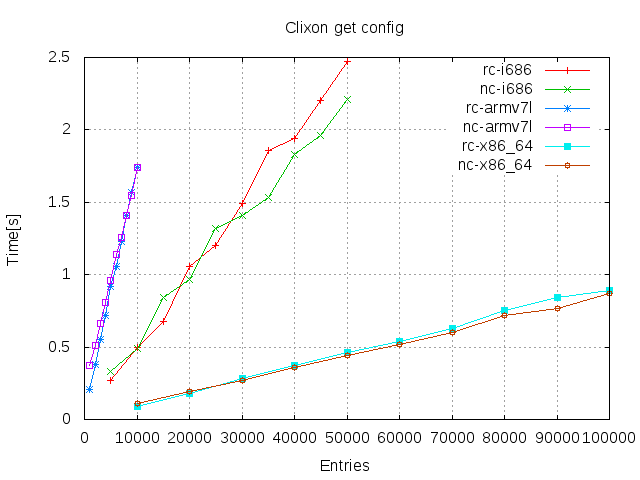
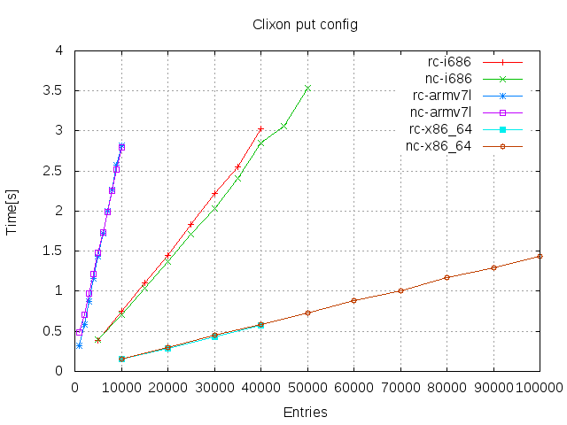
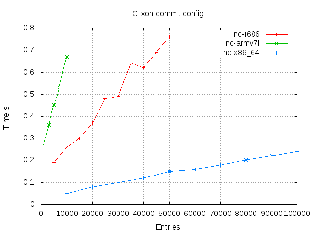
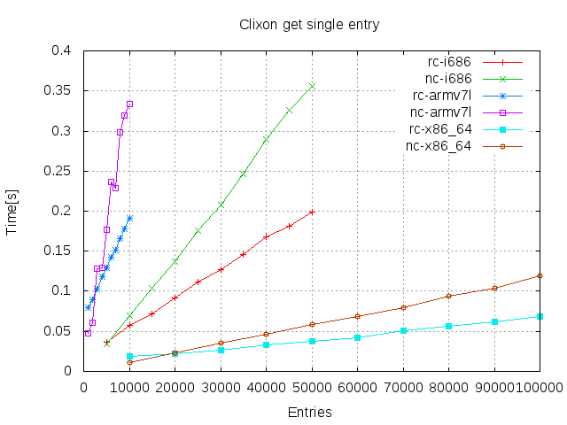
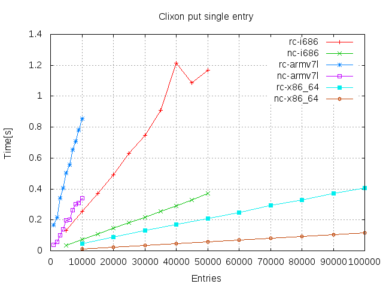
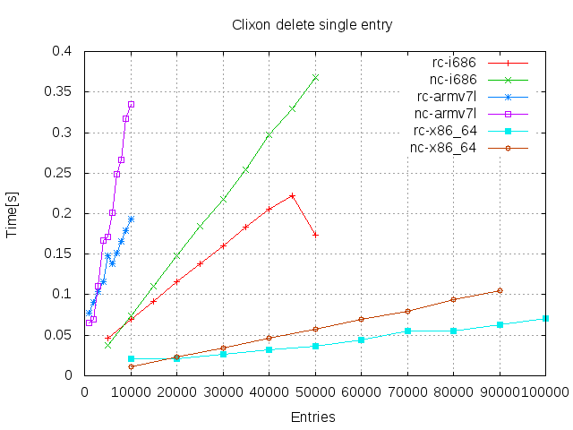

# Large lists in Clixon

  * [Background](#background)
  * [Overview](#overview)
  * [Test descriptions](#test-descriptions)
  * [Results](#results)
  * [References](#references)

## Background

CIixon can handle large configurations. Here, large number of elements
in a "flat" list is presented.  There are other scaling usecases,
such as large configuratin "depth", large number of requesting
clients, etc.

## Overview

The basic case is a large list, according to the following Yang specification:
```
   container x {
      description "top-level container";
      list y {
         description "List with potential large number of elements";
         key "a";
         leaf a {
            description "key in list";
            type int32;
         }
         leaf b {
            description "payload data";
            type string;
         }
      }
   }
```
where `a` is a unique key and `b` is a payload, useful in replace operations.

XML lists with `N` elements are generated based on
this configuration, eg for `N=10`:
```
   <y><a>0</a><b>0</b></y>
   <y><a>1</a><b>1</b></y>
   <y><a>2</a><b>2</b></y>
   <y><a>3</a><b>3</b></y>
   <y><a>4</a><b>4</b></y>
   <y><a>5</a><b>5</b></y>
   <y><a>6</a><b>6</b></y>
   <y><a>7</a><b>7</b></y>
   <y><a>8</a><b>8</b></y>
   <y><a>9</a><b>9</b></y>
```

Requests are either made over the _whole_ dataset, or for one specific element. The following example shows a Restconf GET operation of a single element:
```
   curl -X GET http://localhost/restconf/data/scaling:x/y=3
   {"scaling:y": [{"a": 3,"b": "3"}]}

```

Operations of single elements (transactions) are made in a burst of
random elements, typically 100. 

## Tests

All details of the setup are in the [test script](../../test/plot_perf.sh).

### Testcases

All tests measure the "real" time of a command on a lightly loaded
machine using the Linux command `time(1)`.

The following tests were made (for each architecture and protocol):
* Write `N` entries in one single operation. (With an empty datastore)
* Read `N` entries in one single operation. (With a datastore of `N` entries)
* Commit `N` entries (With a candidate of `N` entries and empty running)
* Read 1 entry (In a datastore of `N` entries)
* Write/Replace 1 entry (In a datastore of `N` entries)
* Delete 1 entry (In a datastore of `N` entries)

The tests are made using Netconf and Restconf, except commit which is made only for Netconf.

### Architecture and OS

The tests were made on the following hardware, all running Ubuntu Linux:
* i686: dual Intel Core Duo processor (IBM Thinkpad X60)
* arm: ARMv7 Processor rev 5 (v7l) (Raspberry PI 2 Model B)  
* x86-64: Intel Quad-core I5-8259U (Intel NUC Coffee Lake)

i686: Ubuntu 16.04.6 LTS
```
Linux version 4.4.0-143-generic (buildd@lgw01-amd64-037) (gcc version 5.4.0 20160609 (Ubuntu 5.4.0-6ubuntu1~16.04.10) ) #169-Ubuntu SMP Thu Feb 7 07:56:51 UTC 2019
```

Arm : Raspbian GNU/Linux 9
```

Linux version 4.14.79-v7+ (dc4@dc4-XPS13-9333) (gcc version 4.9.3 (crosstool-NG crosstool-ng-1.22.0-88-g8460611)) #1159 SMP Sun Nov 4 17:50:20 GMT 2018
```

x86_64: Ubuntu 18.04.1 LTS
```
inux version 4.15.0-47-generic (buildd@lgw01-amd64-001) (gcc version 7.3.0 (Ubuntu 7.3.0-16ubuntu3)) #50-Ubuntu SMP Wed Mar 13 10:44:52 UTC 2019
```

## Results













## Discussion


## References

[RFC6241](https://tools.ietf.org/html/rfc6241) "Network Configuration Protocol (NETCONF)"
[RFC8040](https://tools.ietf.org/html/rfc8040) "RESTCONF Protocol"
[i686](https://ark.intel.com/content/www/us/en/ark/products/27235/intel-core-duo-processor-t2400-2m-cache-1-83-ghz-667-mhz-fsb.html)
[plot_perf.sh](../test/plot_perf.sh) Test script


